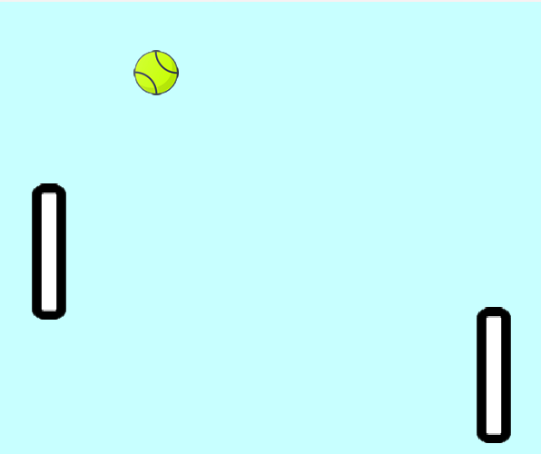

# My ping pong game
### My aducation project


#### Game settings
```python
SCREEN_SIZE = (600, 500)
SCREEN_COLOR = (200, 255, 255)
TICK_RATE = 60

PLAYER1_POS = (30, 200)
PLAYER2_POS = (520, 200)

PLAYER_SIZE = (50, 150)
PLAYER_SPEED = 4
PLAYER_IMG = 'racket.png'
PLAYER1_CONTROL = {'Up': pygame.K_w, 'Down': pygame.K_s}
PLAYER2_CONTROL = {'Up': pygame.K_UP, 'Down': pygame.K_DOWN}

BALL_SIZE = (50, 50)
BALL_SPEED = 4
BALL_IMG = 'tenis_ball.png'
BALL_POSE = (200, 200)

FONT_SIZE = 25
FONT_COLOR = (180,0,0)
FONT_POSE = (200, 200)
PLAYER1_LOSE_TEXT = 'PLAYER 1 LOSE'
PLAYER2_LOSE_TEXT = 'PLAYER 2 LOSE'
```

### Object-oriented architecture
```python
class GameSprite(pygame.sprite.Sprite):
    SPRITE_SIZE = (65, 65)

    def __init__(self, image_path, pos, speed, size=SPRITE_SIZE):
        super().__init__()
        self.image = pygame.transform.scale(
            pygame.image.load(image_path),
            size
        )
        self.rect = self.image.get_rect()
        self.rect.x, self.rect.y = pos

        self.speed = speed

    def draw(self, window):
        window.blit(self.image, (self.rect.x, self.rect.y))


class Player(GameSprite):
    def __init__(self, image_path, pos, speed, size, control: dict):
        super().__init__(image_path, pos, speed, size)
        self.control = control

    def update(self, keys):
        if keys[self.control['Up']]:
            self.rect.y -= self.speed
        if keys[self.control['Down']]:
            self.rect.y += self.speed
```
1. Склонировать репозиторий
```bash
git clone ???
cd ???
```
2. Склонировать репозиторий
```bash
# Windows
python -m venv .venv 
. .venv/Script/activate
pip -r install requirments.txt

# Linux/Mac
python3 -m venv .venv 
source .venv/bin/activate
pip -r install requirments.txt
```
3. Запуск
```bash
# Windows
python main.py

# Linux/Mac
python3 main.py
```